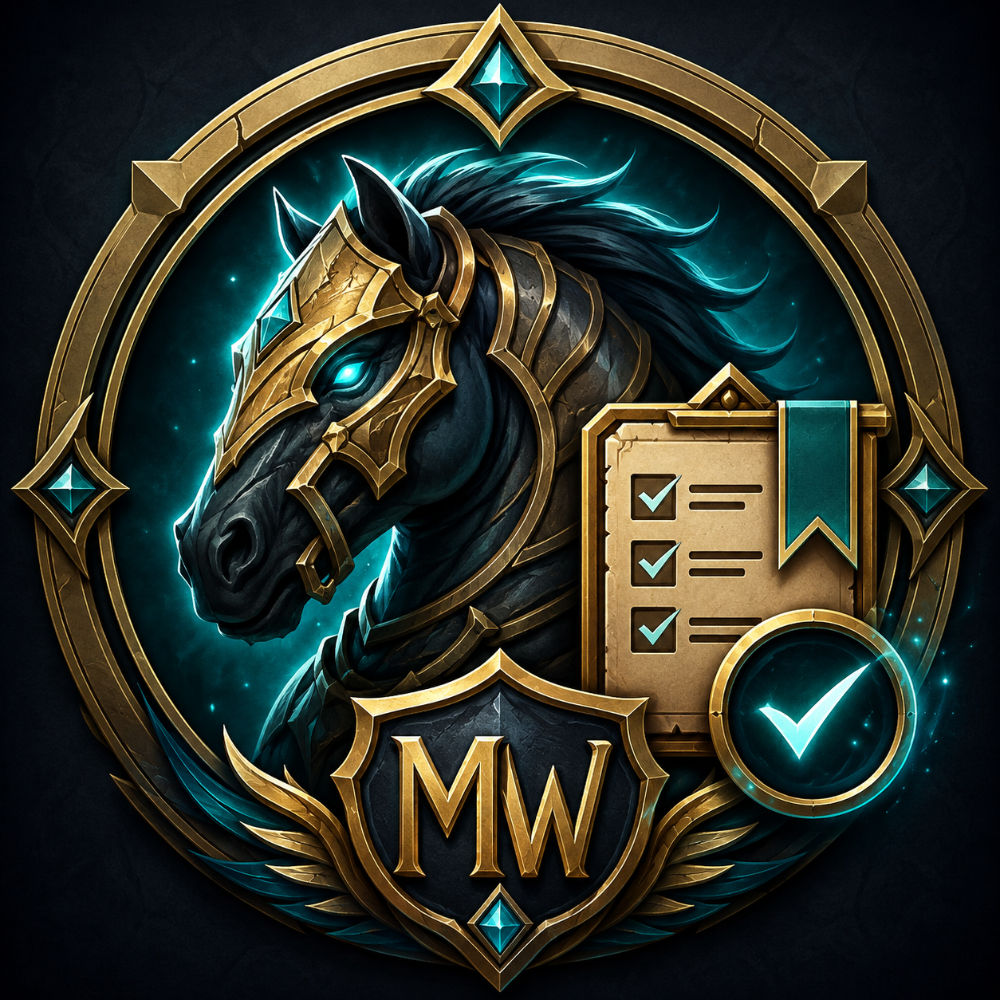

# Mount Watchlist

Mount Watchlist is a lightweight World of Warcraft addon for creating a personal list of uncollected mounts you want to work towards.

Instead of replacing the default Mount Journal, the addon extends it with a watchlist and provides a separate overview of the mounts you are currently tracking.

## Features

- Browse uncollected mounts
- Add mounts to a personal watchlist
- Add mounts directly from the Warband Collections Mount Journal
- Search mounts by:
  - Name
  - Source type
  - Blizzard's acquisition text
- Filter mounts by:
  - Drop
  - Vendor
  - Achievement
  - Quest
  - Profession
- View Blizzard's mount source information
- Automatically remove mounts from the watchlist after collecting them
- Ctrl + Left Click a mount to preview it in the Dressing Room
- Account-wide persistent watchlist

## Usage

Open the watchlist with:
```
/mwl
```
or:
```
/mountwatchlist
```
You can also select an uncollected mount in:

Warband Collections → Mounts

and click:

+ Watch Mount

to add it directly to your watchlist.

### Dressing Room

Hold Ctrl and left-click a mount in the Mount Watchlist window to preview it in the Dressing Room.

### Installation
CurseForge

Install Mount Watchlist through the CurseForge app.

### Manual installation

Download the latest release and extract the MountWatchlist folder into:
World of Warcraft/_retail_/Interface/AddOns/

The final directory should look like:
World of Warcraft/_retail_/Interface/AddOns/MountWatchlist/MountWatchlist.toc

Restart World of Warcraft or use:
/reload

### How it works

Mount Watchlist primarily uses Blizzard's built-in Mount Journal APIs, including:

C_MountJournal.GetMountIDs()
C_MountJournal.GetMountInfoByID()
C_MountJournal.GetMountInfoExtraByID()

Because acquisition information comes directly from Blizzard's Mount Journal, Mount Watchlist does not require a separately maintained database for every mount.

The watchlist is stored in the SavedVariables table:
MountWatchlistDB

### Compatibility

Mount Watchlist is intended for World of Warcraft Retail.

### Planned Features

Some possible future additions:

Expansion and zone filters
More detailed source grouping
TomTom integration
Raid and dungeon lockout tracking
Daily / weekly farm tracking
Improved sorting options
Localization

### Bugs and Feature Requests

If you encounter a bug or have an idea for a feature, please open an issue on GitHub.

When reporting UI bugs, screenshots are especially helpful.

### License

See LICENSE.